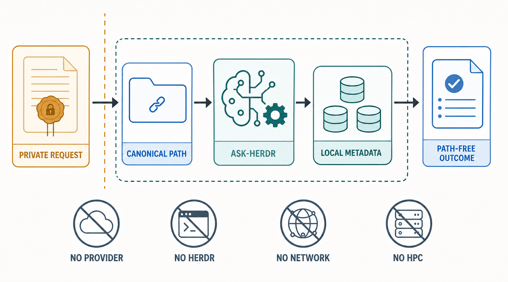
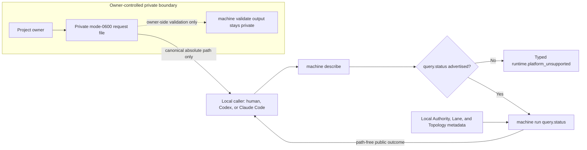
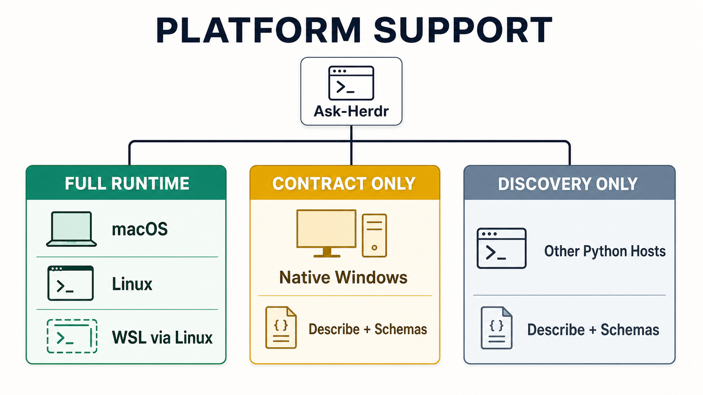
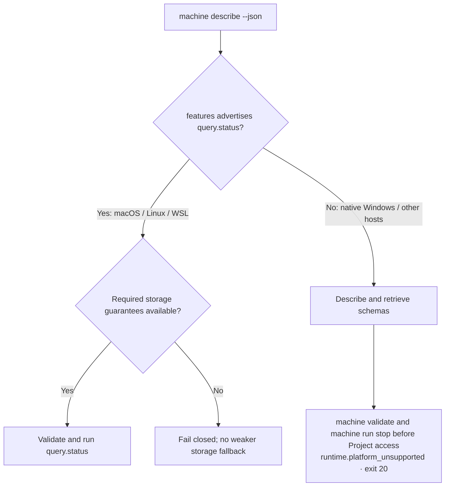

# Ask-Herdr

Ask-Herdr is an experimental, source-only interface for reading authenticated
Project metadata through one provider-free operation: `query.status`.

[](https://github.com/TrailblazerSR/ask-herdr/actions/workflows/ci.yml)
[](docs/platform-support.md)
[](LICENSE)
[](#current-claim-ceiling)

> [!NOTE]
> Ask-Herdr is an independent companion project built for the open-source
> [Herdr runtime](https://github.com/herdrdev/herdr). Use the
> [official Herdr documentation](https://herdr.dev/docs/) for upstream
> installation, runtime behavior, and command guidance.

The command runs locally. It does not invoke an AI provider, Herdr, a network
service, a hosted backend, or a remote/HPC resource. It does not create or
discover Project bindings.

## Quick start

From the repository root, use Python 3.10 or later to discover the current
executable contract before trying an operation. On a POSIX shell:

```text
python3 bin/ask-herdr machine describe --json
```

On PowerShell:

```text
& 'C:\Path\To\python.exe' 'bin/ask-herdr' machine describe --json
```

Read `runtime_platform` and `features`, and continue only when the operation you
need is advertised. Retrieve its exact schema ID from that same response:

```text
python3 bin/ask-herdr machine schema --id EXACT_ADVERTISED_ID
```

The executable and its advertised schemas are authoritative. For a synthetic
request and an owner-prepared private status read, follow the
[getting-started guide](docs/public-beta-getting-started.md). The
[`query.status` contract](docs/public-beta-query-status.md) defines its typed
outcomes and privacy invariants.



## How a status read works



In an agent-mediated run, the agent sees the canonical request-file path and
the path-free outcome. The request JSON, Project root, Authority UUID,
validation output, and raw durable records stay inside the owner-controlled
boundary.

## Requirements

- Python 3.10 or later;
- macOS or Linux for the full provider-free `query.status` path (WSL follows
  the Linux/POSIX contract); and
- for a real status read, an already-bound Project root and matching Authority
  UUID supplied privately by that Project's owner.

Native Windows supports contract discovery and bundled schema retrieval in
this release. Machine Validation and Machine Run remain held there until a
versioned Windows path, ACL, and Project-store protocol exists. See the
[platform-support matrix](docs/platform-support.md) for exact host profiles and
launch forms.





The runtime uses only the Python standard library. Development tests also use
`jsonschema`; see `requirements-dev.txt`.

## Agent onboarding

Codex-compatible agents discover the canonical workflow at
`.agents/skills/ask-herdr/SKILL.md`. Claude Code discovers the pointer-only
adapter at `.claude/skills/ask-herdr/SKILL.md`; it delegates to the same
canonical skill.

For an agent-mediated read, the Project owner prepares a mode-`0600` request
outside the repository and supplies only its canonical absolute path. The
request JSON, Project root, Authority UUID, and v1 validation output stay out
of agent/model context. The Machine Run outcome is path-free.

Direct Herdr control is a separate capability. Agents must follow
`skills/herdr-command-authority/SKILL.md`, the installed release-matched skill
and schema, and the latest official Herdr documentation before constructing a
Herdr command. `query.status` itself does not use Herdr.

## Current claim ceiling

- Only `query.status` is executable through Machine Run.
- Only immediate, metadata-only observation with `advisory=none` executes.
- macOS and Linux provide native Machine Validation and `query.status`; WSL
  uses the Linux profile; native Windows is contract-only.
- There is no public Project bootstrap, package release, human facade, hosted
  service, provider-backed operation, deployment, or compatibility promise.
- A synthetic unbound Project normally returns a typed reconciliation or
  unavailable outcome; it cannot prove a real status observation.

## Development

Create an isolated environment, install the test dependency, and run the
included suite. On a POSIX shell:

```text
python3 -m venv .venv
. .venv/bin/activate
python -m pip install -r requirements-dev.txt
python -m unittest discover -v -s tests
```

On PowerShell:

```text
& 'C:\Path\To\python.exe' -m venv .venv
& '.\.venv\Scripts\python.exe' -m pip install -r requirements-dev.txt
& '.\.venv\Scripts\python.exe' -m unittest discover -v -s tests
```

See [CONTRIBUTING.md](CONTRIBUTING.md), [SECURITY.md](SECURITY.md), and
[SUPPORT.md](SUPPORT.md) before opening an issue or pull request.

## License

Ask-Herdr is licensed under the Apache License, Version 2.0. See
[LICENSE](LICENSE).
