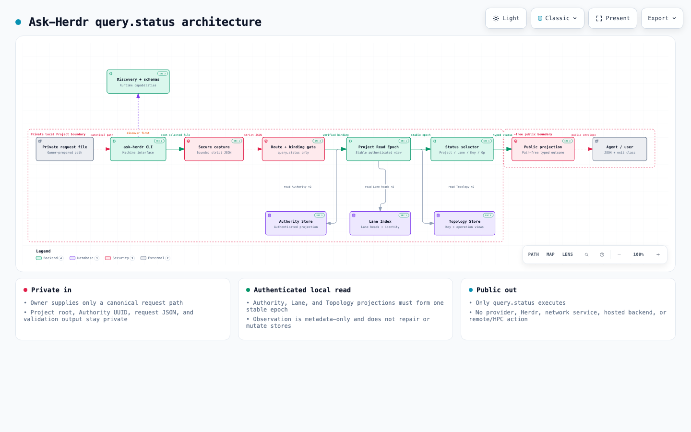

# Ask-Herdr implementation architecture

This source-grounded map describes the active provider-free `query.status`
path in public Ask-Herdr commit
`e770dbdbada6351dcb1016b23a92a353698552a8`, tree
`4addba80b8a75c406336368b4390a400a837672a`. It is a communication artifact;
the executable and its advertised schemas remain authoritative.

<picture>
  <source media="(prefers-color-scheme: dark)" srcset="assets/ask-herdr-implementation-architecture.dark.png">
  <source media="(prefers-color-scheme: light)" srcset="assets/ask-herdr-implementation-architecture.light.png">
  
</picture>

## Reading the map

1. **Discover first.** `machine describe` and the exact schemas advertised by
   that response define the current runtime capability and request contract.
2. **Private input.** The Project owner prepares the private request outside
   the repository. An agent receives only its canonical absolute path.
3. **Fail-closed capture and binding.** The CLI performs bounded descriptor
   capture, strict JSON parsing, trusted-header checks, full request-schema
   validation, and Project/Authority binding verification.
4. **Authenticated local observation.** A Project Read Epoch coordinates the
   Authority Store, Lane Index, and Topology Store projections. Each complete
   attempt reads the coordinated metadata twice and accepts only a stable,
   authenticated tuple.
5. **Typed selection.** The active route can select Project, Lane UUID,
   Consultant Key, or operation UUID status under the current cursor and
   reconciliation rules.
6. **Public output.** The projection removes private paths and records before
   returning one path-free typed result and exit class.

## Scope limits

- Only `query.status` is shown as executable through Machine Run.
- Observation is immediate and metadata-only; it does not repair or mutate the
  Project stores.
- The runtime path uses the Python standard library and the local Project
  filesystem.
- It invokes no AI provider, Herdr runtime, network service, hosted backend,
  or remote/HPC resource.
- It does not create or discover a Project binding.
- Native Windows remains contract-only in this preview. See
  [platform support](platform-support.md) for the exact host matrix.
- Dormant operation names, provider profiles, direct Herdr control, recovery
  execution, and other inactive surfaces are intentionally absent from the
  map.

## Provenance and regeneration

The typed diagram source is
[`architecture/ask-herdr.architecture.json`](architecture/ask-herdr.architecture.json).
It declares 14 source references pinned to the Ask-Herdr revision above.

The diagram was generated with
[Archify v2.15.0](https://github.com/tt-a1i/archify/releases/tag/v2.15.0)
at commit `e1ac748f19cf805e44bf74fb93c796662152e273`. Archify is distributed
under the [MIT License](https://github.com/tt-a1i/archify/blob/v2.15.0/LICENSE).
Ask-Herdr does not install or depend on Archify at runtime or during tests.

From the `archify/` package directory inside a pinned Archify v2.15.0 checkout
(the directory containing `bin/archify.mjs` and `package.json`), substitute the
canonical Ask-Herdr path and validate the frozen source against the matching
checkout. Do not execute `PATH_TO_ASK_HERDR` literally:

```text
node bin/archify.mjs validate architecture PATH_TO_ASK_HERDR/docs/architecture/ask-herdr.architecture.json --quality showcase --repo-root PATH_TO_ASK_HERDR --json
```

The recorded generation passed all nine showcase checks with zero composition
errors and zero warnings. The light and dark README images are bounded
1440×900 visual-evidence captures. The interactive HTML was intentionally not
committed because that generated viewer references externally hosted fonts and
includes browser scripting. Static images keep the repository-facing diagram
self-contained.

When the active implementation architecture changes, update the pinned
Ask-Herdr revision in the typed source, revalidate every source reference,
regenerate both theme captures, inspect them, and update this record. A passing
renderer receipt does not replace manual source or visual review.
